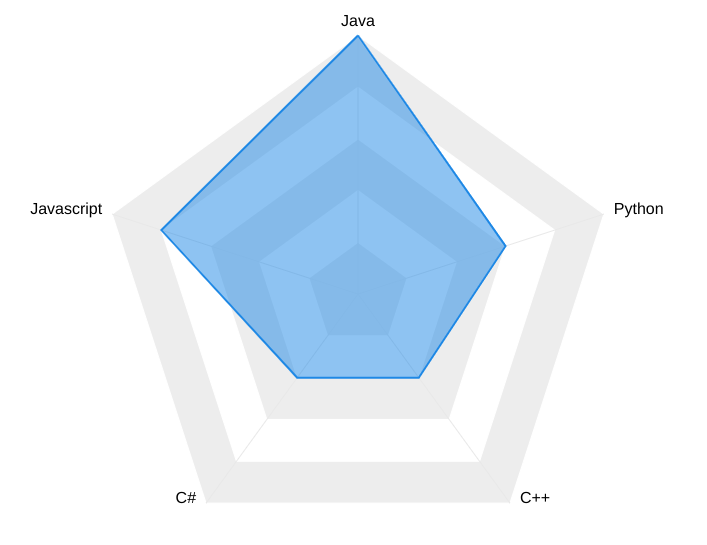

# Data Studio Community ApexCharts Radar Visualization

This visualization was created using [ApexCharts.js][ApexCharts.js] and was adapted to work with [Google Data Studio][datastudio] using [dscc][dscc]. The radar/spider chart is a web-shaped diagram used to indicate the relative influence of different numerical parameters.



## About this visualization

The [ApexCharts Radar][ApexCharts-Radar] chart community visualization takes 1 dimension and up to 5 metrics. It works best with dimensions of moderate cardinality - for example, dimensions with 5-10 unique values.

## Deployed Version
Component ID of the deployed version of this visualization:

```bash
gs://duncanross-test/radar-prod
```

### Authors

This code was written by Duncan Ross.

### Additional Links

[ApexCharts][ApexCharts]

[Data Studio Community Visualizations][community-viz]

[community-viz]: http://developers.google.com/datastudio/visualization
[datastudio]: https://datastudio.google.com
[dscc]:https://github.com/googledatastudio/tooling
[ApexCharts-Radar]: https://apexcharts.com/docs/chart-types/radar/
[ApexCharts.js]:https://github.com/apexcharts/apexcharts.js
[ApexCharts]:https://apexcharts.com/


