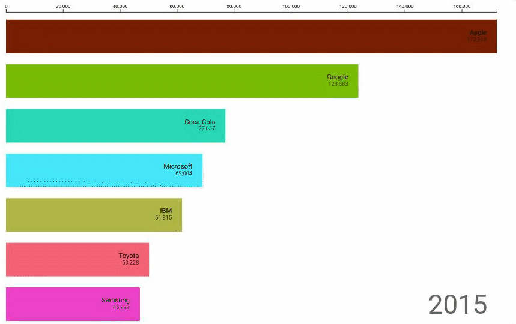

# Animated Bar Chart

This visualization was created using [D3.js][d3] and was adapted to work with [Google Data Studio][datastudio] using [dscc][dscc]. The animated bar chart is a visualization that allows users to visualize changes in metric for the same dimension over an interval of time on a bar graph.



## About this visualization

The Animated Bar Chart community visualization takes 1 date range, 1 dimension and 1 metric. It organizes the dimension and metric according to the dates given, and generates "keyframes" for each date. The visualization will interpolate for missing data across keyframes in order to generate fluid, easy to follow transitions.

## Deployed Version
Component ID of the deployed version of this visualization:

```bash
gs://animatedbar-test/prod
```

## Future Work

* Implement the granularity algorithm found in `common.ts`
* Add additional styling options
    * Legend, vertical bars, axis switching
* Add scrub bar for animation control
* Rework labels to be on side of the bar if bar is too small

### Authors

This code was written by Duncan Ross.


### Additional Links

[Data Studio Community Visualizations][community-viz]


[community-viz]: http://developers.google.com/datastudio/visualization
[datastudio]: https://datastudio.google.com
[dscc]:https://github.com/googledatastudio/tooling
[d3]:https://d3js.org/