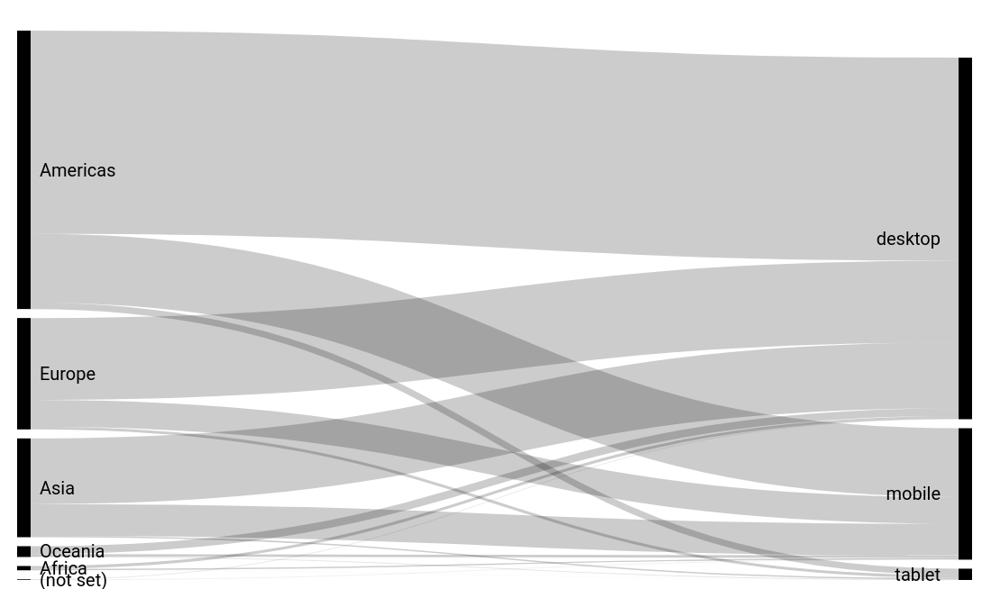

# Data Studio Community Sankey community visualization

Data Studio [community visualizations][community viz] allow you to write custom
JavaScript visualizations for [Google Data Studio][datastudio].



This [sankey] community visualization built with d3.js takes 2 dimensions and a metric.

> Note: This sankey will not render if the two dimensions have overlapping values.
> For example: if > `a` exists in dimension 1, dimension 2 cannot have the value `a`.

## Deployed version

Component ID of the deployed version of this visualization:

```
gs://public-community-viz-showcase-reports/sankey
```

See the visualization [deployed].


## Authors

This code was written by the [Data Studio Developer Relations][community viz] team.

[community viz]: http://developers.google.com/datastudio/visualization
[datastudio]: https://datastudio.google.com
[sankey]: https://en.wikipedia.org/wiki/Sankey_diagram
[deployed]: https://datastudio.google.com/u/0/reporting/1hdqhp5dK31BcFInZzmaQOEQdVB54D4gz/page/j9DU
