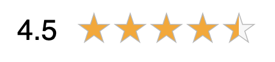

# Data Studio Community Visualization: Star Rating

Data Studio [community visualizations][community viz] allow you to write custom
JavaScript visualizations for [Google Data Studio][datastudio].

Visualize and monitor the voice of your consumers with star ratings built with D3.js; great for ecommerce products, content, application and company reviews, etc.

Expects at least one metric from 1 to 5. If you provide more than one metric, you can use the Data Studio features to decide whether to count, sum, average, etc. If you provide a dimension for each metric, you can filter to the dimension's rating of your choice.

## Deployed version
`gs://data_studio_com_vis_star_rating`

## Example report
[Star Rating Data Studio Report Example](https://datastudio.google.com/reporting/1qQcyuAIwI45Hv-mszKFBokrmoQFb9xJZ/page/LS04)

## Author
Amanda Schroeder, [Bounteous] 

[Bounteous]: https://bounteous.com