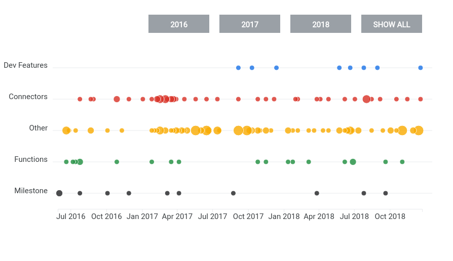

# Data Studio Release Notes Timeline Visualization

Data Studio [community visualizations][community viz] allow you to write custom
JavaScript visualizations for [Google Data Studio][datastudio].



## About the release notes timeline

This visualization was created for the Google Cloud [blog post] introducing Data Studio community visualizations. It was written to visually represent Data Studio release notes from 2016-Jan 2019.

The visualization assumes a datasource with 4 columns:

1. Index: Unique row ID used to deaggregate the data
1. Date: Date (in 'YYYY-MM-DD' string format)
1. Title: ~1 sentence description
1. Category: Used to color dots and distribute them vertically

## Deployed version

The deployed version of this visualization is deployed at:

```
gs://public-community-viz-showcase-reports/timeline-v2
```

See the visualization [deployed].

## Authors

This code was written by the [Data Studio Developer Relations team][community viz].

[community viz]: http://developers.google.com/datastudio/visualization
[datastudio]: https://datastudio.google.com
[blog post]: https://cloud.google.com/blog/products/data-analytics/build-custom-data-viz-with-data-studio-community-visualizations
[deployed]: https://datastudio.google.com/c/u/0/reporting/1A_n0bUPX6wsVcAF2TqwIocBBRA962som/page/cMuf
